# Solfege Karaoke


A karaoke player for Thai karaoke songs, written in Rust: NCN song packs
and its own `.sfkar` format, a SoundFont synth for the backing tracks, and
lyrics that light up syllable by syllable.

โปรแกรมคาราโอเกะสำหรับเพลงไทย เล่นเพลง NCN และไฟล์ `.sfkar` ด้วยเสียงจาก
SoundFont พร้อมเนื้อร้องที่ไล่สีทีละพยางค์

> [!WARNING]
> **Experimental project — not for production use.**
> This is a work in progress. The `.sfkar` format, the song catalogue,
> saved settings and every API may change without notice or migration.
> Expect rough edges and missing features; do not rely on it for events,
> venues or anything you cannot afford to have break.

> [!IMPORTANT]
> **No support for proprietary or pirated karaoke formats.** This project
> does not support EMK, XMK, SIB, Sonic Karaoke or similar formats, nor
> the use of its code to read them or to play unlicensed songs. See
> [Acceptable use](#acceptable-use).
>
> **ไม่สนับสนุนฟอร์แมตคาราโอเกะเชิงพาณิชย์หรือเพลงละเมิดลิขสิทธิ์** โปรเจกต์นี้
> ไม่รองรับ EMK, XMK, SIB, Sonic Karaoke หรือฟอร์แมตลักษณะเดียวกัน และไม่สนับสนุน
> การนำโค้ดไปใช้อ่านไฟล์เหล่านั้นหรือเล่นเพลงที่ไม่ได้รับอนุญาต ดู
> [ข้อตกลงการใช้งาน](#acceptable-use)

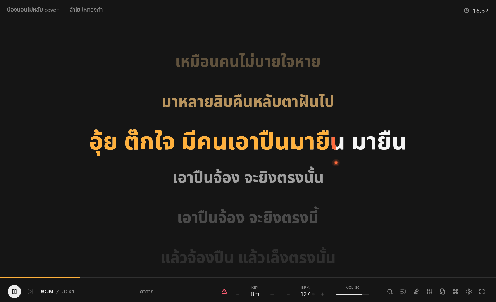

| | |
|---|---|
| 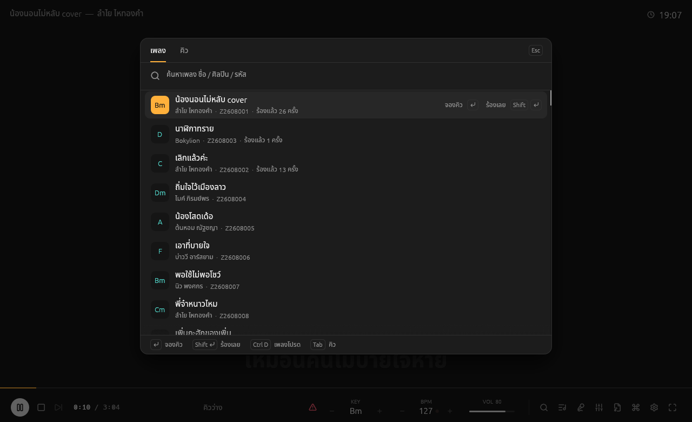 | 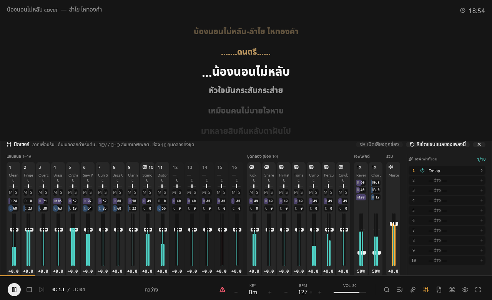 |
| Song search overlay (`/`) | Mixer panel (`M`): strips scroll sideways, effect chain on the right |
| 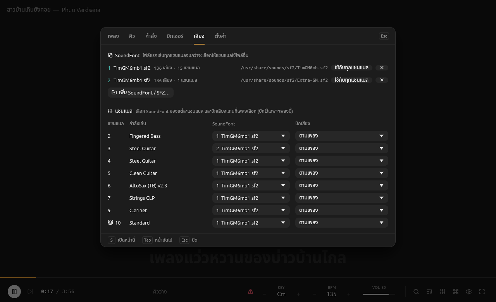 | 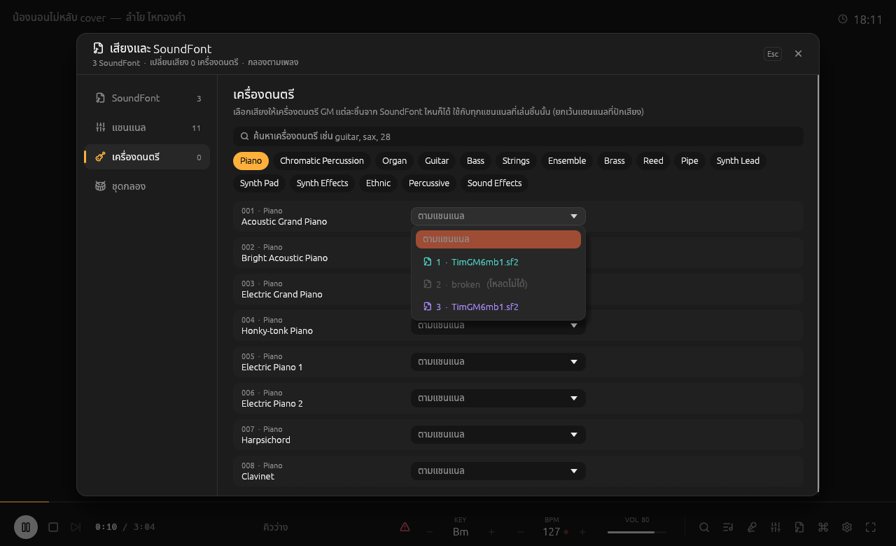 |
| Sound settings window (`S`): SoundFont per channel | A sound for any GM instrument |
| 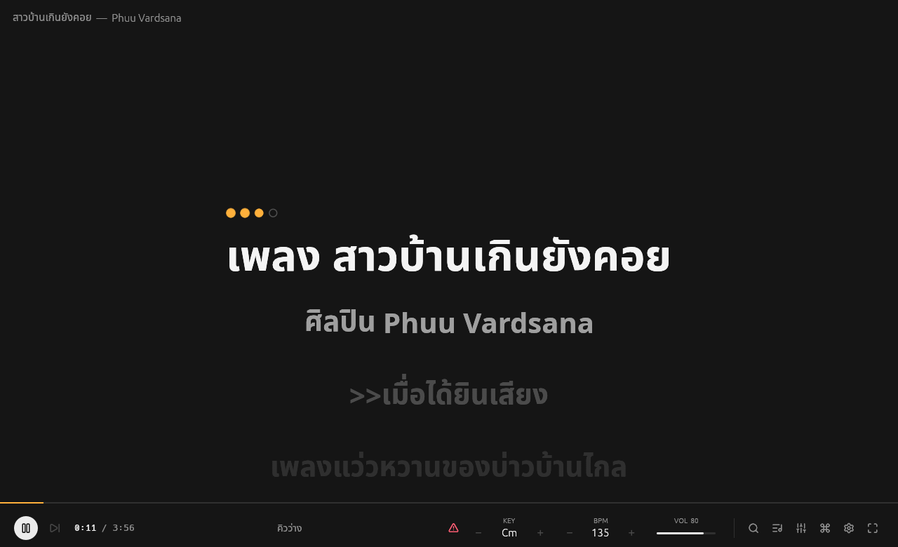 | 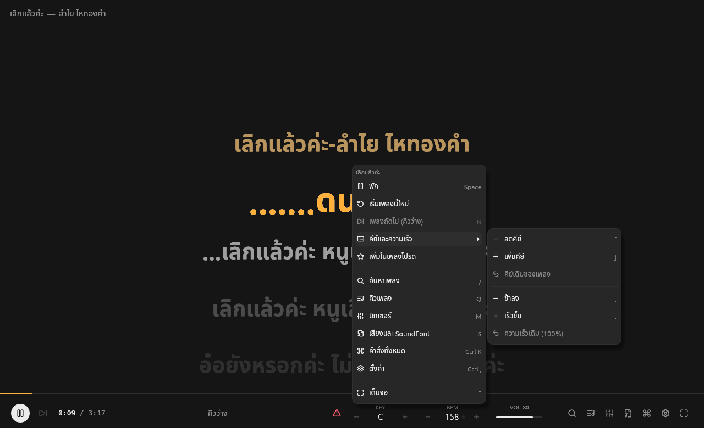 |
| Four-beat count-in after a long rest | Right-click menu on the stage |
| 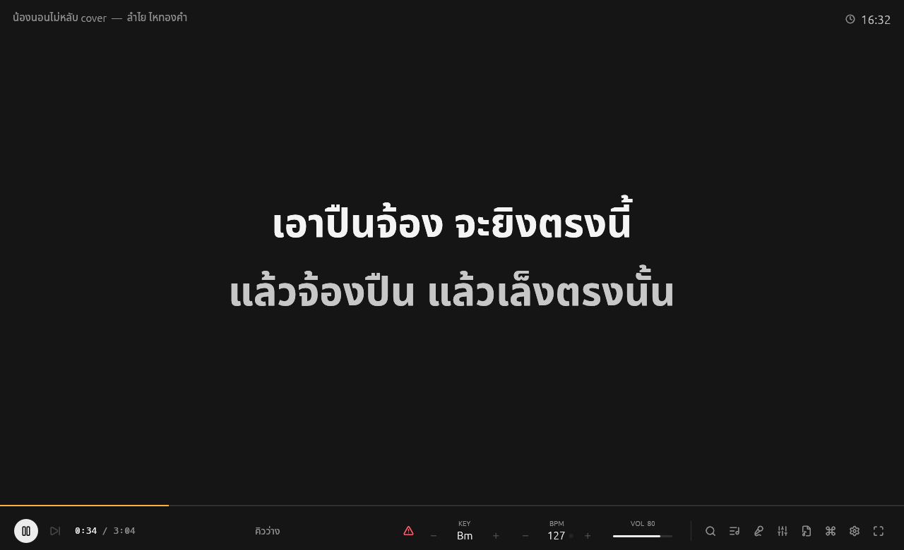 | 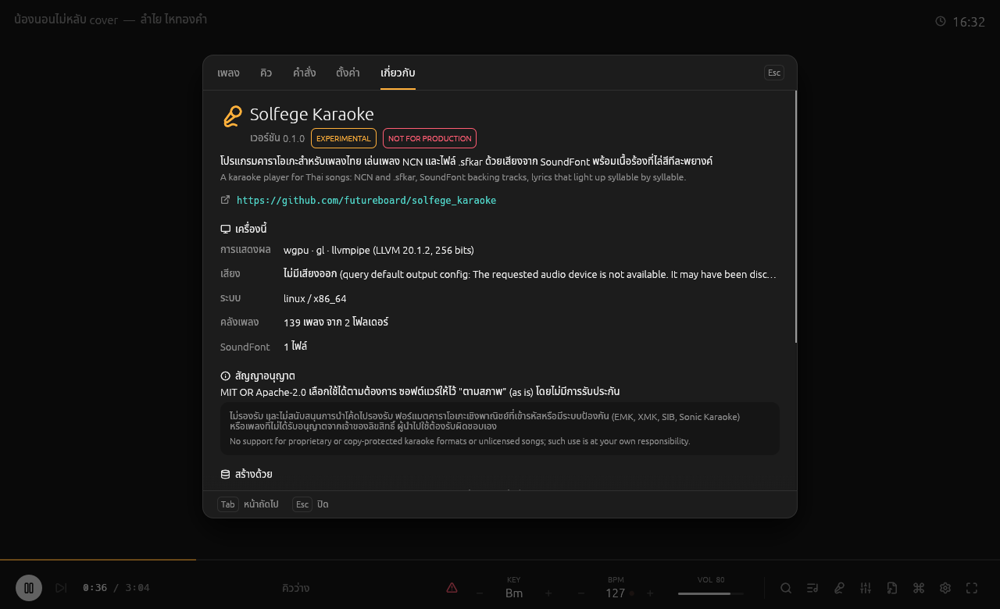 |
| Classic layout: two lines that take turns (`L`) | About page |
| 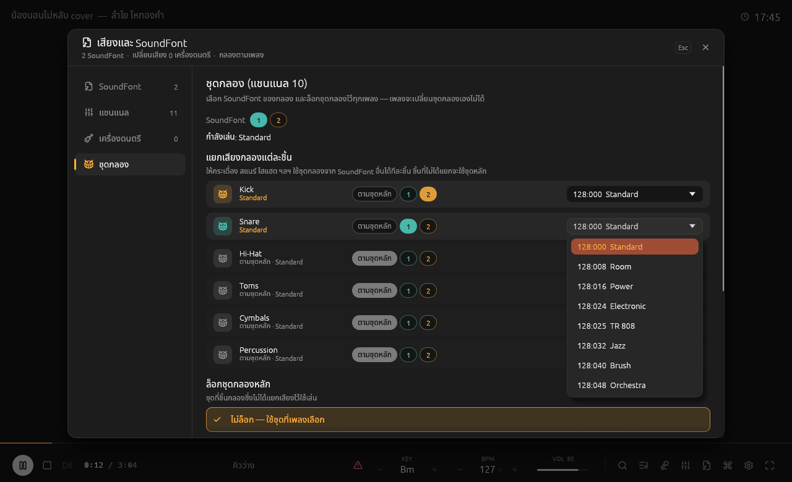 | 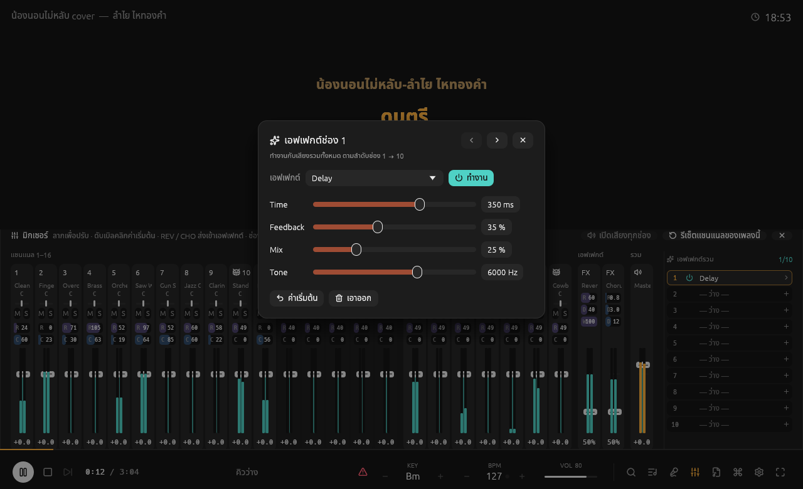 |
| Kick, snare, ... each from its own SoundFont and kit | Effect slot editor (popup over the mixer) |
| 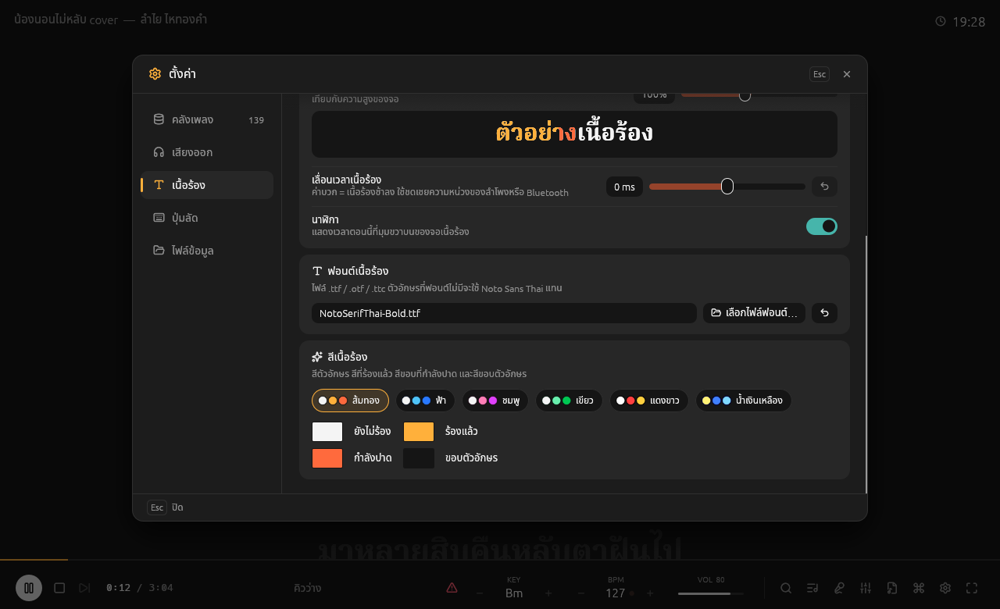 | 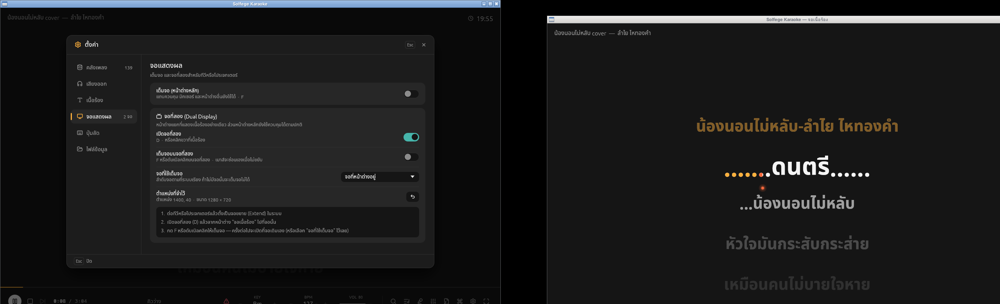 |
| Settings popup (`Ctrl ,`): lyric font and colours | Second screen (`D`): lyrics on the TV, controls on the laptop |
| 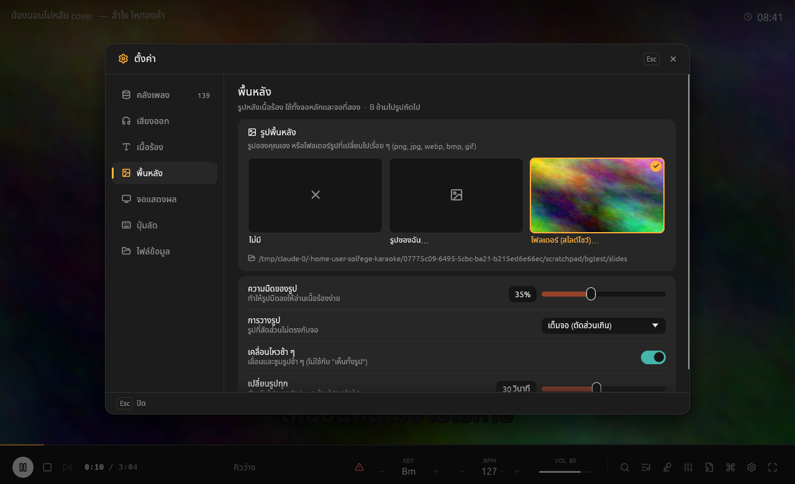 | |
| Background settings: your own picture or a slideshow folder | |

## What is in here

| Path | What it is |
|---|---|
| [`app/karaoke`](app/karaoke) | **Solfege Karaoke** (`solfege-karaoke`), the egui karaoke player |
| [`app/ncn2sfkar`](app/ncn2sfkar) | `ncn2sfkar`, converts an NCN library to `.sfkar` files |
| [`app/liveinst`](app/liveinst) | `simpletui`, a terminal instrument rack (WAV / SFZ / SF2) with MIDI I/O and a web UI |
| [`crates/solfege_ncnparser`](crates/solfege_ncnparser) | Parser for NCN libraries (`Song/*.mid`, `Lyrics/*.lyr`, `Cursor/*.cur`) |
| [`crates/solfege_sfkar`](crates/solfege_sfkar) | The `.sfkar` song file: read, write, convert from NCN |
| [`crates/solfege_songdb`](crates/solfege_songdb) | Song catalogue (SQLite) over NCN and `.sfkar` folders, with search, favourites and play history |
| [`crates/solfege_synth`](crates/solfege_synth) | Sample-based synth engine (WAV, SFZ, SF2), MIDI file player and audio output |

## The karaoke player

- **Lyric stage.** Lines fill with colour per syllable (Thai vowels and
  tone marks are shaped properly), in one of two layouts (`L`):
  *scroll*, where the line being sung sits in the middle and finished
  lines drift up, or *classic*, two fixed lines in the middle that take
  turns. A title card shows before the singing starts, four dots count
  in after a long rest, and the time of day sits in the corner with four
  dots beside it that count the beats of the bar like a metronome (1 2 3 4,
  following the song's tempo; taken as 4/4 from the start).
  The lyric colours (still to sing, sung, the wipe edge, outline) come
  from six presets or a colour picker each, the outline's thickness goes
  from none to four times the default, and the lyrics can use any
  `.ttf` / `.otf` / `.ttc` font (letters it lacks fall back to Noto Sans
  Thai).
- **Guide melody off** (`V`). Mutes MIDI channel 9, where NCN songs
  carry the vocal melody, in every song until turned back on.
- **Overlays.** Songs and queue share one panel over the stage (`/`,
  `Q`, `Tab` between them); all commands (`Ctrl K`), settings (`Ctrl ,`)
  and About open as popups of their own. Every popup and window can be
  dragged by its title bar (double-click it to put it back).
- **Settings.** Sections for the song library (folders, counts, rescan),
  audio output (device, volume, guide melody), lyrics (layout, size with
  a live sample, outline thickness, timing, clock, font, colours),
  shortcuts and the data files.
- **Context menus.** Right click the stage or the bottom bar for
  playback, key and tempo, every panel and full screen; right click a
  song, a queued song, a mixer strip, a SoundFont or a channel for what
  applies to it. Each entry shows its keyboard shortcut.
- **Full screen** (`F`, `F11` or double-click the stage) fills the screen
  and keeps everything: bottom bar, mixer, overlays and windows. Type to filter, arrows to move, Enter to
  act.
- **Backgrounds.** Any picture file (png, jpg, webp, bmp, gif), or a
  folder of pictures shown as a slideshow with a cross-fade; the app
  ships no pictures of its own. Settings › background sets how dark the
  picture is, how it fits the screen and a slow pan and zoom; `B` skips
  to the next picture of the slideshow. Both screens show it, and the
  mixer opens over it rather than pushing it up.
- **MIDI I/O.** Settings › audio picks the **MIDI Output**: the
  *Solfege Engine* (the built-in SoundFont synth) or any MIDI device: a
  keyboard, a sound module, or a synth on the computer (on Windows,
  "Microsoft GS Wavetable Synth"). For a device the player still keeps
  time; the key, mute / solo, the guide-melody switch and VOL (as GM
  Master Volume) still apply, GM / GS / XG resets and drum parts are
  passed on, and every note-off goes to the key its note-on went to.
  SoundFonts, faders and effects only shape the engine's own sound. A
  **MIDI Input** (a keyboard to play along) plays wherever the song plays,
  on its own channels or moved to one channel (16, for instance).
- **Second screen (dual display)** (`D`). A window of its own with only
  the lyrics, for a TV or projector, while the main window keeps the
  controls. Drag it onto the other display and press `F` (or double-click)
  for full screen there, or pick the display in Settings; it reopens in
  the same place, full screen if it was. The pointer hides on it after
  two seconds, and every shortcut works from it too.
- **Song catalogue.** Any number of NCN libraries and `.sfkar` folders in
  one searchable list, with favourites and play counts, kept in an SQLite
  database (`songs.dat`); songs can be queued. A folder of `.sfkar` files
  converted from an NCN library lists its own copies next to the NCN
  ones, each tagged NCN or SFKAR.
- **Native file dialogs.** SoundFonts and song folders are picked with
  the system's own dialog: the common item dialog on Windows, NSOpenPanel
  on macOS and the XDG desktop portal on Linux (the desktop's file chooser
  on Wayland or X11, `zenity` when no portal runs).
- **Key and tempo.** Change key by semitones (the drums stay put) and
  tempo from 50 % to 150 %; BPM and key are shown live.
- **Mixer.** Its own panel, docked under the lyrics: all 16 MIDI channels
  (channel 10 is the fader for the whole drum kit), each drum-kit piece,
  reverb and chorus returns and master, with gain, pan, mute, solo,
  reverb / chorus sends and meters. Strips keep a readable width; when
  they do not all fit, a scrollbar (or the mouse wheel) slides them
  sideways. Pan and sends start from the song's
  own values (MIDI CC 10, 91, 93) and your adjustment goes on top;
  double-click returns to the song's value. The reverb (room, damping,
  width) and chorus (rate, depth, delay) are adjustable on their return
  strips and remembered between runs.
- **Master effect chain.** Ten effect slots in a sidebar on the right of
  the mixer, run in order on the main output: EQ, compressor, limiter,
  delay, reverb, chorus, drive, filter and stereo width. Click a slot to
  edit it in a popup; each can be bypassed, moved or cleared (right
  click), and the chain is saved in `config.json`.
- **Sound settings window.** SoundFonts, channels, instruments and the
  drum kit have their own window (`S` or the bar button), separate from
  the command overlay.
- **SoundFont rack.** Up to eight SoundFonts (or SFZ instruments). Route
  each MIDI channel to any of them, pin a different sound on a channel,
  or choose the sound of any of the 128 General MIDI instruments, from
  any font, for whichever channel plays it.
- **Drum kit lock.** Lock channel 10 to one kit; songs cannot change it.
- **A kit per drum piece.** Kick, snare, hi-hat, toms, cymbals, cowbell
  and percussion can each play from a kit of their own, from any SoundFont;
  the pieces left alone play from channel 10's kit. Their mixer strips
  work the same either way.

### Keyboard

| Key | | Key | |
|---|---|---|---|
| `Space` | play / pause | `/` | search songs |
| `Shift Space` | stop (back to the start) | | |
| `←` `→` | back / forward 5 s | `Q` | queue |
| `[` `]` | key down / up | `M` | mixer panel |
| `,` `.` | slower / faster | `S` | sound settings window |
| `V` | guide melody (channel 9) on / off | `L` | lyric layout |
| `N` | next song in the queue | `Ctrl K` | all commands |
| `F` / `F11` | full screen (`Esc` leaves) | `Ctrl ,` | settings |
| `D` | second screen on / off | `B` | next background picture (slideshow) |
| right click | context menu | | |

In the song / queue panel: `Enter` reserves a song, `Shift Enter` sings it
now, `Ctrl D` marks a favourite, `Tab` switches between songs and queue and
`Esc` closes; `Esc` closes any popup.

## Getting started

### Requirements

- Rust **1.95** or newer (edition 2024), and a C compiler (SQLite is
  built from source by `rusqlite`).
- **Linux:** ALSA headers and `pkg-config` to build
  (`sudo apt install libasound2-dev pkg-config` on Debian / Ubuntu), and
  OpenGL plus `libxkbcommon-x11` to run. File dialogs need
  `xdg-desktop-portal` (any desktop has it) or, without one, `zenity`.
- **Windows:** nothing extra (audio goes through WASAPI).
- macOS is untested.
- Graphics go through **wgpu** (Vulkan, Metal or Direct3D 12, with
  OpenGL as a fallback), so any GPU from the last decade, or a software
  renderer such as llvmpipe, works.

### Songs and sounds

Neither songs nor SoundFonts are part of the repository.

- **Sample songs.** An NCN sample pack is used for development and tests.
  Unpack it into `shared/` so that `shared/NCN/Song`, `shared/NCN/Lyrics`
  and `shared/NCN/Cursor` exist:

  ```sh
  curl -LO https://cdn.futureboard.studio/NCN.zip
  unzip NCN.zip -d shared
  ```

- **SoundFont.** Any General MIDI `.sf2` works (for example the
  `timgm6mb-soundfont` or `fluid-soundfont-gm` packages on Debian /
  Ubuntu). The player looks in `shared/`, next to the executable and in
  `/usr/share/sounds/sf2`, or you can add one in the sound settings window.

### Run

```sh
cargo run --release -p karaoke                     # the karaoke player
cargo run --release -p karaoke -- Z2608001         # start a song by its code
cargo run --release -p karaoke -- song.sfkar       # play a .sfkar file directly
cargo run --release -p karaoke -- -s gm.sf2 -s piano.sfz -L /path/to/NCN
cargo run --release -p karaoke -- --help
```

Settings and the song catalogue are kept in the app's data folder
(`~/.local/share/solfege-karaoke` on Linux,
`%APPDATA%\solfege-karaoke\data` on Windows; both paths are also shown
under Settings):

| File | What it holds |
|---|---|
| `config.json` | Settings as readable JSON: SoundFont rack and routing, sounds per instrument, drum kit lock, reverb / chorus, audio device, MIDI output and input, background, lyric size, offset, outline, colours and font, the second screen's place. Edit it while the player is closed; missing fields take their defaults. `--config <FILE>` uses another file. |
| `songs.dat` | The song catalogue, an SQLite database: song folders, songs, favourites and play history. |

Settings and catalogues of older versions (eframe's `app.ron`,
`songs.json`) are imported on the first start.

### Convert NCN to `.sfkar`

```sh
cargo run --release -p ncn2sfkar -- shared/NCN                 # all songs -> shared/NCN-sfkar/
cargo run --release -p ncn2sfkar -- shared/NCN -o out Z2608001 # some songs
cargo run --release -p ncn2sfkar -- shared/NCN --dry-run       # check only
```

Existing files are kept unless `--force` is given; the exit code is
non-zero if any song failed.

## The `.sfkar` format

One file per song, so a song no longer needs three parallel folders and
its text is UTF-8 instead of Windows-874:

```text
"SFKR"  u16 version (1)  u16 flags (0)
chunks: 4-byte id, u32 length (little endian), data
  META  JSON: title, artist, key, source id, duration
  MIDI  a Standard MIDI File (the backing track)
  LYRC  JSON: lines of [tick, text] segments with an end tick
```

Lyric times are ticks of the MIDI chunk, so they follow its tempo map and
any playback speed. Readers skip chunks they do not know. The full
description is in [`crates/solfege_sfkar`](crates/solfege_sfkar/src/lib.rs).
As the project is experimental, the format may still change.

## Development

```sh
cargo test --workspace      # needs shared/NCN; a few tests also use a .sf2
cargo clippy --workspace --all-targets
```

See [CONTRIBUTING.md](CONTRIBUTING.md) for the details.

<a id="acceptable-use"></a>

## Acceptable use / ข้อตกลงการใช้งาน

**English.** Solfege Karaoke plays songs you have the right to use. We do
not support, and will not accept contributions for, using this source
code in any way to:

- read, convert, play or otherwise support proprietary, encrypted or
  copy-protected karaoke formats, including **EMK, XMK, SIB and Sonic
  Karaoke** files, or to break or bypass their encryption or protection;
- play, convert, copy or distribute song libraries obtained without the
  permission of their rights holders.

Issues and pull requests asking for such support will be closed. Anyone
who uses or modifies this code for these purposes does so entirely on
their own responsibility; the authors and contributors accept no
liability of any kind for it. The software is provided "as is", without
warranty, as stated in both licences below. This notice is not legal
advice; check the law where you live.

**ภาษาไทย** Solfege Karaoke มีไว้เล่นเพลงที่ผู้ใช้มีสิทธิ์ใช้งานเท่านั้น
เราไม่สนับสนุน และจะไม่รับการมีส่วนร่วม (contribution) ใด ๆ ที่นำซอร์สโค้ดนี้ไปใช้
ไม่ว่าในลักษณะใดก็ตาม เพื่อ

- อ่าน แปลง เล่น หรือรองรับฟอร์แมตคาราโอเกะเชิงพาณิชย์ที่เข้ารหัสหรือมีระบบป้องกัน
  การคัดลอก รวมถึงไฟล์ **EMK, XMK, SIB และ Sonic Karaoke** หรือเพื่อถอดรหัส
  หรือหลบเลี่ยงระบบป้องกันของไฟล์เหล่านั้น
- เล่น แปลง คัดลอก หรือเผยแพร่คลังเพลงที่ได้มาโดยไม่ได้รับอนุญาตจากเจ้าของลิขสิทธิ์

Issue และ pull request ที่ขอให้รองรับสิ่งเหล่านี้จะถูกปิด ผู้ที่นำโค้ดไปใช้หรือดัดแปลง
เพื่อวัตถุประสงค์ดังกล่าวต้องรับผิดชอบการกระทำของตนเองแต่เพียงผู้เดียว ผู้พัฒนาและ
ผู้มีส่วนร่วมจะไม่รับผิดชอบใด ๆ ทั้งสิ้น ซอฟต์แวร์นี้ให้ไว้ "ตามสภาพ" (as is) โดยไม่มี
การรับประกันตามสัญญาอนุญาตทั้งสองฉบับด้านล่าง ข้อความนี้ไม่ใช่คำแนะนำทางกฎหมาย
โปรดตรวจสอบกฎหมายในประเทศของคุณ

## AI policy

Contributions written with AI assistants are welcome under the rules in
[AI_POLICY.md](AI_POLICY.md) (English / ไทย): you review, test and answer
for every line, say which tools you used, and keep the licensing clean.

## License

Licensed under either of

- Apache License, Version 2.0 ([LICENSE-APACHE](LICENSE-APACHE) or
  <https://www.apache.org/licenses/LICENSE-2.0>)
- MIT license ([LICENSE-MIT](LICENSE-MIT) or <https://opensource.org/licenses/MIT>)

at your option.

Unless you explicitly state otherwise, any contribution intentionally
submitted for inclusion in the work by you, as defined in the Apache-2.0
license, shall be dual licensed as above, without any additional terms or
conditions.

### Third-party assets

The karaoke player bundles fonts under their own licences:

- Noto Sans Thai and Noto Sans, SIL Open Font License 1.1
  ([`app/karaoke/assets/fonts/OFL.txt`](app/karaoke/assets/fonts/OFL.txt))
- Lucide icons, ISC License
  ([`app/karaoke/assets/fonts/LUCIDE-LICENSE.txt`](app/karaoke/assets/fonts/LUCIDE-LICENSE.txt))

Song data, SoundFonts and the NCN sample pack are not covered by this
repository's licence; use them according to their own terms.
